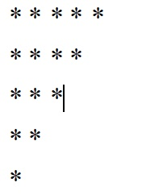

# 编程输出如下图形


> 代码如下：
>```java
>    public class Print {
>        public static void main(String[] args) {
>            for (int i = 0; i < 5; i++) {
>                for (int j = 5; j > i; j--) {
>                    System.out.print("*");
>                } 
>                System.out.println();
>            }
>        }
>    }
>```

# [返回](../README.md)